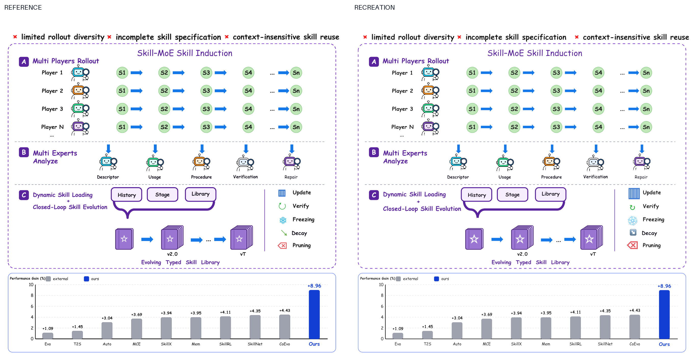
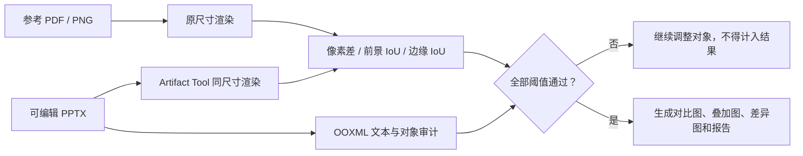

# draw-in-powerpoint

当前仓库只做一件事：**给定一张论文插图，按原画布、原文案、原布局、原对象关系和原视觉样式，复刻成可编辑 PowerPoint。**

这不是“理解原图后重新画一张意思相近的图”。1 → 1 阶段禁止改写标题、删减元素、重新排版、替换结构或用整张参考图铺底。只有通过自动差异门禁的案例，才会计入合格复刻数。

## 当前严格结果

| 案例 | 像素相似度 | 前景 IoU | 边缘 IoU | 文本覆盖率 | PPT 对象数 | 整页图片铺底 | 结果 |
|---|---:|---:|---:|---:|---:|---:|---|
| Skill-MoE Figure 1 | 98.72% | 83.94% | 73.11% | 100% | 193 | 0 | **PASS** |



[查看透明叠加图](docs/strict-recreation/skillmoe-fig1/skillmoe-fig1-overlay.png) · [查看差异热图](docs/strict-recreation/skillmoe-fig1/skillmoe-fig1-diff.png) · [查看完整机器报告](docs/strict-recreation/skillmoe-fig1/report.json) · [下载可编辑 PPTX](SkillMoE_Fig2_corrected_editable.pptx)

### 复刻逻辑

1. 以 `SkillMoE_Fig1.pdf` 的 540 × 540 pt 页面为唯一真值，不重写任何可见文字。
2. 保留三段虚线分区、四条 rollout、五个 expert、三组 skill library、右侧五项演化操作和底部十柱结果图。
3. 机器人、圆形状态、箭头、卡片、括号、图例、坐标轴和柱体分别保留为独立对象；当前 PPTX 第一页包含 193 个对象。
4. 用与参考图相同的正方形画布渲染到 1350 × 1350 px，再计算全图像素差、前景交并比和边缘交并比。
5. 从 PPTX 的 OOXML 中提取文字与对象，要求 37 个关键文本全部出现，同时拒绝覆盖画布 80% 以上的单张图片。

## 严格 1 → 1 门禁



每个案例必须同时满足：

- 原画布比例与完整可见内容一致；
- 关键文字 100% 覆盖，不允许同义改写；
- 模块、重复图元、连线、颜色角色和相对坐标不省略；
- 不存在整页或近整页参考图铺底；
- 对象数量达到案例声明的最低覆盖要求；
- 像素相似度、前景 IoU 和边缘 IoU 达到案例自己的硬阈值；
- 机器报告、参考/复刻拼接图、50% 透明叠加图和差异热图全部生成。

运行严格门禁：

```bash
npm run qa:strict
```

严格案例清单位于 [`benchmark/strict/manifest.json`](benchmark/strict/manifest.json)，每个案例的真值、PPTX、关键文本和阈值在 `benchmark/strict/*.json` 中声明。

## 三阶段路线

| 阶段 | 输入 | 输出 | 状态 |
|---|---|---|---|
| **1 → 1：严格复刻** | 一张论文参考图 | 内容与版式一致的可编辑 PPTX | **当前唯一主线；1/10 通过** |
| **0.5 → 1：受控改写** | 参考图 + Method + 改写要求 | 表述相近、风格或排版不同的新图 | 未开始 |
| **0 → 1：原创生成** | Method + 用户要求 | 一张或多张论文插图 | 未开始 |

只有严格复刻累计至少 10 张已发表顶会论文插图并全部通过门禁后，仓库才进入 0.5 → 1。

## 关于旧 benchmark

`benchmark/cases/` 和 `docs/benchmark/` 中原有的 10 个案例只复现了论文图的语义骨架，存在删减、改写和重新排版。它们已被明确降级为 **semantic sketch / 结构草图**：

- 不计入 1 → 1 合格数；
- 不再作为首页复刻效果；
- 仅保留用于未来研究“场景规格为什么会丢失细节”；
- 在通过同一套严格门禁前，不得重新标记为复刻。

## 仓库结构

```text
.
├── benchmark/
│   ├── strict/                       # 严格 1→1 真值、阈值与清单
│   └── cases/                        # 已降级的语义草图规格
├── docs/
│   ├── strict-recreation/            # PASS 案例的对比、叠加、差异和报告
│   └── benchmark/                    # 旧语义草图输出，不计入成绩
├── scripts/
│   ├── strict_recreation_qa.py       # 像素、文字、对象与反铺底门禁
│   ├── validate_reference_scene.mjs  # 旧 Scene Spec 校验
│   └── create_reference_recreation.mjs
├── SkillMoE_Fig1.pdf                 # 首个严格参考
└── SkillMoE_Fig2_corrected_editable.pptx
```

## 来源与使用边界

参考论文插图只用于非商业研究、评估和复刻工作流验证；著作权归论文作者或其他权利人所有。发布或再利用前，请核对论文页面、会议政策和原始许可。

## 路线图

- [x] 撤销“语义相似即可视为复刻”的旧验收口径
- [x] 建立像素差、前景 IoU、边缘 IoU、关键文本和对象覆盖率门禁
- [x] 禁止整页参考图铺底
- [x] 完成首张严格 1 → 1 样例：Skill-MoE Figure 1
- [ ] 完成至少 10 张已发表顶会论文插图的严格复刻
- [ ] 10/10 全部通过后再开始 0.5 → 1
