# draw-in-powerpoint

把论文插图生成拆成可验证的三步，并先把最基础的一步做好：**给一张参考图，在 PowerPoint 中临摹出结构、版式和视觉语言相近、且每个对象仍可编辑的复现图。**

当前仓库聚焦 **1 → 1 参考图临摹**。只有当流水线能稳定复现已经存在的优秀论文插图，才继续做“参考图 + Method 文本”的 0.5 → 1 改写，最后再挑战纯 Method 文本到插图的 0 → 1 生成。

[下载 10 页可编辑复现基准 PPTX](docs/benchmark/reference-recreation-benchmark.pptx) · [查看来源索引](docs/benchmark/sources.csv) · [查看场景规格](benchmark/manifest.json)

## 新的三阶段目标

| 阶段 | 输入 | 输出 | 当前状态 |
|---|---|---|---|
| **1 → 1：临摹** | 一张论文参考图 | 结构、排版、配色和视觉节奏相近的可编辑 PPTX | **当前主线；已建立 10 图基准** |
| **0.5 → 1：受控改写** | 参考图 + 对应 Method 文本 + 改写要求 | 表述相近但风格或排版不同的新图 | 下一阶段 |
| **0 → 1：原创生成** | Method 文本 + 用户要求 | 一张或多张精美论文插图 | 最终阶段 |

这里的“1 → 1”不是像素级复制，也不是复用论文里的独特图片素材；它要求复现可验证的视觉结构：画布比例、分区、模块轮廓、相对位置、阅读方向、重复图元、颜色角色、文字层级和连接关系。

## 1 → 1 临摹流水线

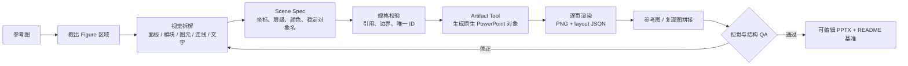

这套流程把“像不像”拆成可以定位和返工的问题：

- **轮廓不像**：修正画布、面板和主模块的相对尺寸。
- **逻辑不像**：修正阅读顺序、箭头方向、分组边界和重复关系。
- **风格不像**：修正色板、线宽、圆角、字体层级和留白。
- **细节不像**：补充 token、网络节点、堆叠模块等重复图元。
- **不可编辑**：禁止整图扁平化，所有关键对象使用稳定名称。

更完整的拆解方法和 Scene Spec 语法见 [参考图临摹规范](references/reference-recreation.md)。

## 顶会论文插图复现基准

当前基准包含 2024 年 ICLR、NeurIPS、ACL、ICML、CVPR 和 EMNLP 已发表论文中的 10 张插图。每张对比图左侧是论文参考图，右侧是本仓库生成的可编辑复现图。

### 01 · ICLR 2024 · MMICL Figure 2

复现逻辑：保持三联架构的等宽面板，用重复的 LLM、VPG、图像和 token 图元表达从单图 VLM 到多模态上下文的演进。

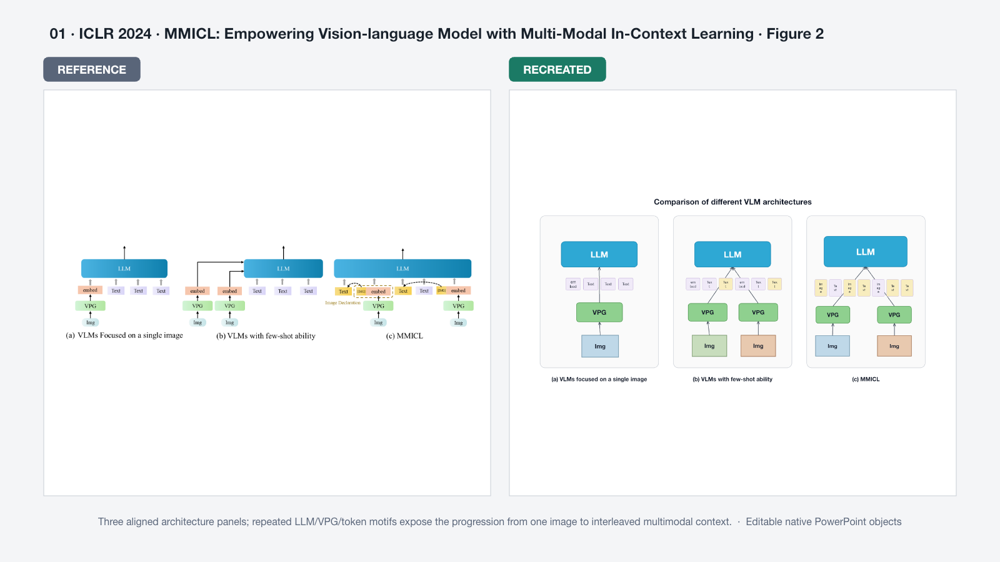

### 02 · ICLR 2024 · Unified Sampling Framework Figure 4

复现逻辑：用“采样集合 → 评估数据集 → Predictor → 搜索空间”的顺时针外环重建迭代搜索流程。

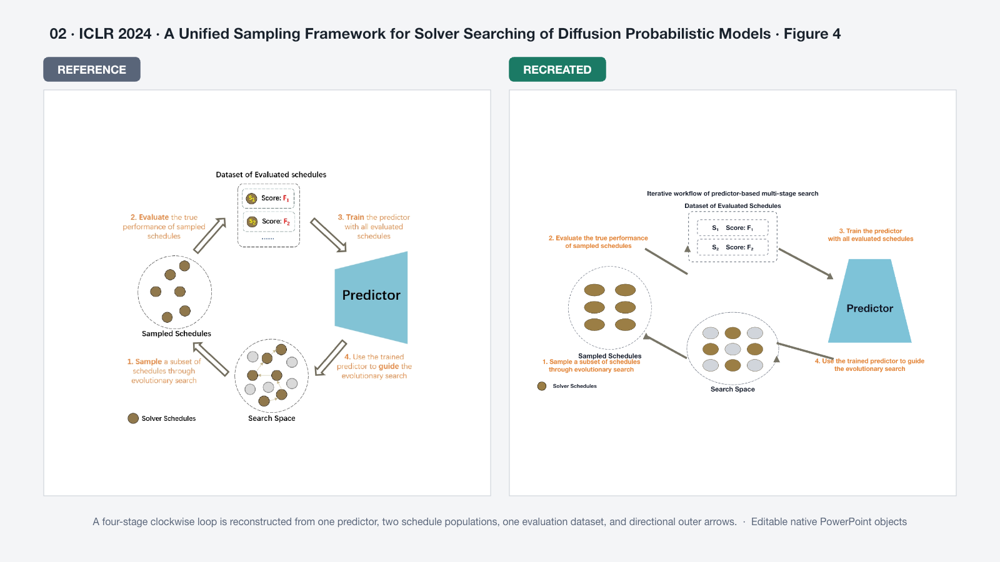

### 03 · NeurIPS 2024 · Diffusion of Thought Figure 2

复现逻辑：把高密度总览拆成任务输入、单次扩散、多次扩散和自纠正四个区域，并保留 token 状态和因果偏置的重复节奏。

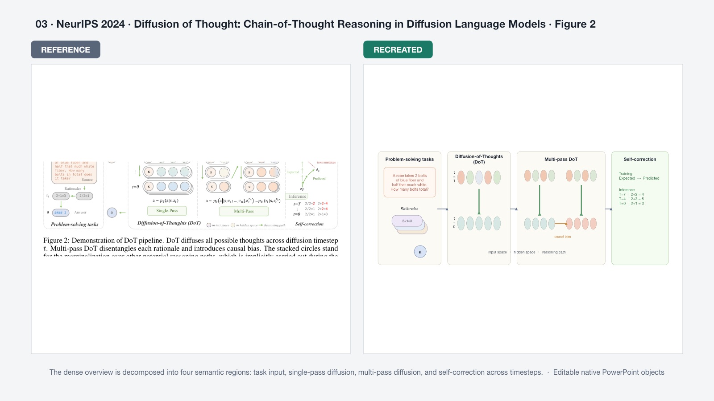

### 04 · ACL 2024 · TransliCo Figure 2

复现逻辑：复用上下两条 Transformer 分支，让原始文本和转写文本经过相同结构，再通过 mean pooling 汇入对比学习目标。

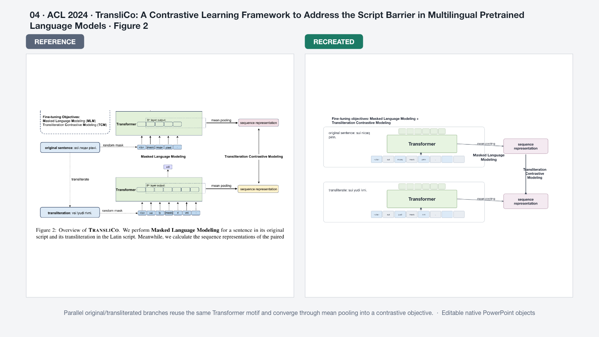

### 05 · EMNLP 2024 · PROF Figure 1

复现逻辑：用交替色块重建从初始写作到 DPO 的横向链路，并用红色回路强调“下一轮模型”的闭环更新。

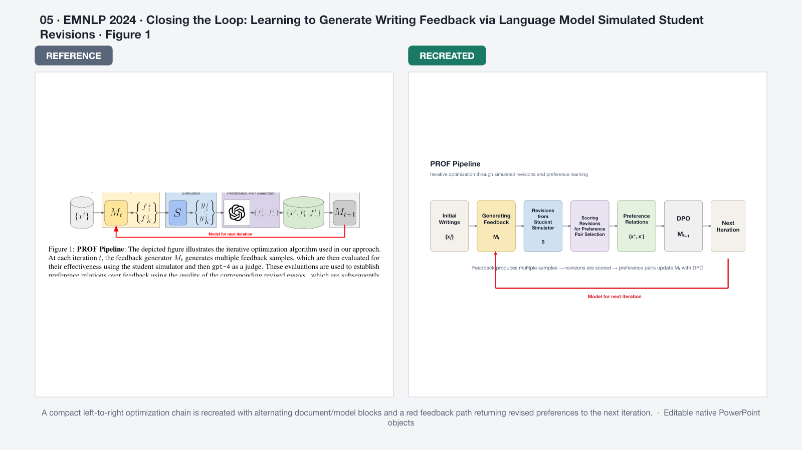

### 06 · ACL 2024 · OBSD Figure 2

复现逻辑：保留“初始解码”和“零样本细化”两块柔和背景区域，用对称扩散模块连接输入、参考字形和最终输出。

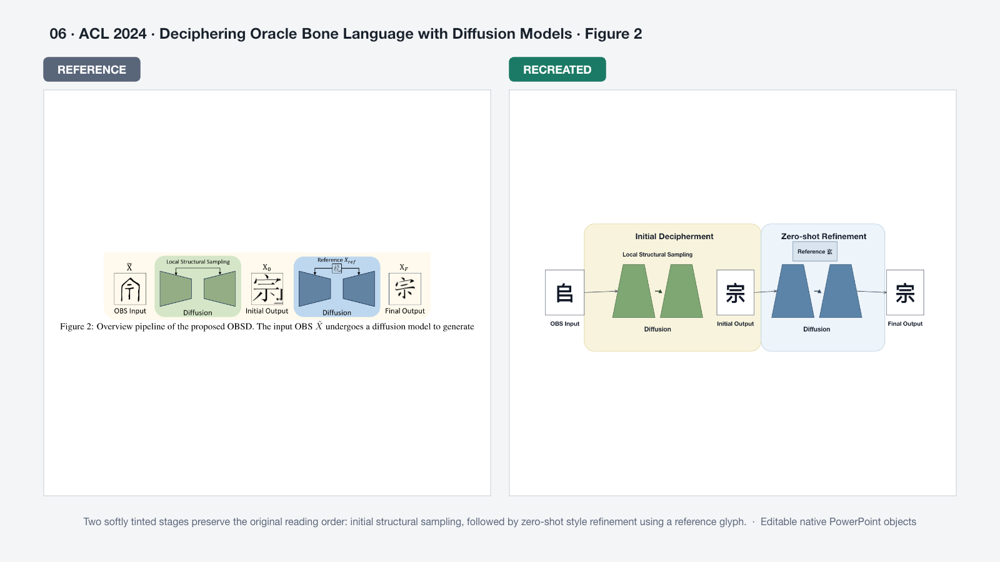

### 07 · ICML 2024 · FiT Figure 2

复现逻辑：用两条平行流水线对照固定分辨率 DiT 与灵活分辨率 FiT，并保留 Resize、Center Crop 和输出尺寸的差异。

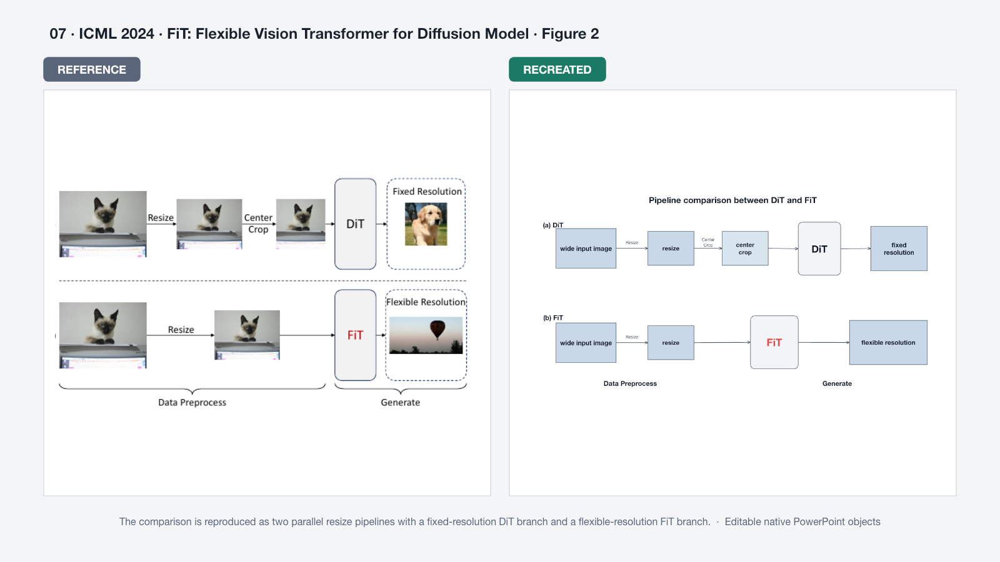

### 08 · CVPR 2024 · SNED Figure 1

复现逻辑：用一个稠密 SuperNet、三个面向不同分辨率的稀疏子网，以及对应的输入/输出图像栈复刻搜索拓扑。

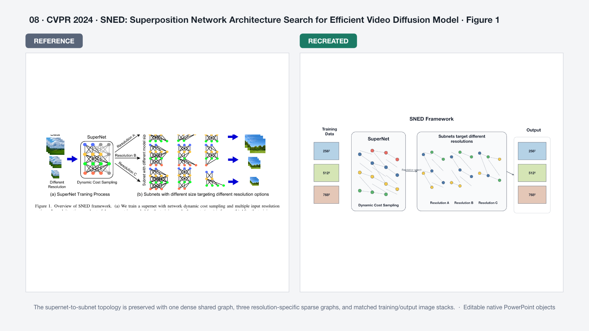

### 09 · NeurIPS 2024 · ControlMLLM Figure 1

复现逻辑：上下复用同一个冻结 MLLM 骨架，仅替换域内/域外视觉 prompt、输入和回答，突出 training-free 迁移。

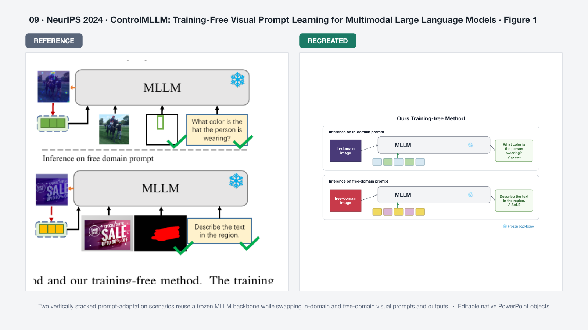

### 10 · ICML 2024 · Early Exiting Figure 2

复现逻辑：用五个逐渐加深的 block 塔和长跳连重建时间相关退出策略，并保留轻量 Decoder 的终止位置。

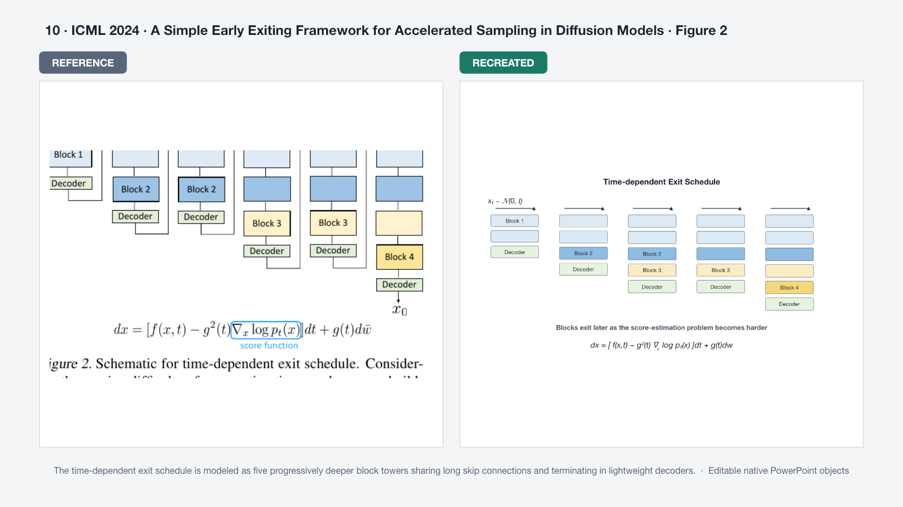

## 快速运行

项目使用 `@oai/artifact-tool` 生成 PowerPoint 原生对象。

```bash
npm run validate:reference
npm run build:reference
npm run check:reference
```

三个命令依次完成：

1. 校验 10 个场景规格、引用关系、对象 ID 和画布边界；
2. 生成 10 页可编辑 PPTX、逐图 PNG、layout JSON 和拼接对比图；
3. 检查导出布局是否存在溢出、裁切或越界标记。

单个案例位于 `benchmark/cases/<case-id>.json`。新增案例时，把规格文件加入 `benchmark/manifest.json`，再运行同一套命令。

## Scene Spec 能表达什么

- `shape`：矩形、圆角矩形、椭圆、梯形、菱形、圆柱等基础轮廓；
- `text`：字体、字号、字重、颜色、对齐和旋转；
- `line` / `connector`：精确位置连线或附着到对象的语义箭头；
- `stack`：错位堆叠的卡片、图像或模块；
- `tokens`：规则排列的 token、block 或小图元；
- `network`：可编辑节点和边构成的网络拓扑；
- `reference_crop`：README 对比图中使用的参考 Figure 裁剪区域；
- 稳定对象名：例如 `module.mllm-free`、`arrow.preference-to-dpo`。

这些图元是当前 1 → 1 阶段的中间表示。它们比直接“看图写一段绘图代码”更容易验证、比较、局部修改和批量回归。

## 成功标准

一个复现案例只有同时满足以下条件才算通过：

- 主阅读方向、分区、模块数量和连接关系与参考图一致；
- 主模块的相对尺寸、位置、色彩角色和视觉节奏相近；
- 没有意外重叠、裁切、越界、标题换行或连接线穿过标签；
- 关键对象均为 PowerPoint 原生对象，并使用稳定语义名称；
- 参考来源、论文、会议和 Figure 编号可追溯；
- 自动生成参考图/复现图拼接结果，便于人工判断“像不像”。

当前基准证明的是：**这条流水线已经具备重建论文插图结构与视觉语法的能力。** 它还不代表对复杂照片、独特插画、任意数学公式或像素级纹理的完美复制。

## 仓库结构

```text
.
├── benchmark/
│   ├── manifest.json                 # 1→1 基准清单
│   └── cases/                        # 每张参考图的 Scene Spec
├── docs/benchmark/
│   ├── references/                   # 论文参考图，仅用于研究与对比
│   ├── recreated/                    # 生成 PNG 与 layout JSON
│   ├── comparisons/                  # README 使用的左右拼接图
│   ├── sources.csv                   # 论文与 Figure 来源
│   └── reference-recreation-benchmark.pptx
├── references/reference-recreation.md
└── scripts/
    ├── validate_reference_scene.mjs
    └── create_reference_recreation.mjs
```

原有 Method 文本到 Level 1 语义骨架的实现仍保留在 `scripts/create_level1_figure.mjs`，作为未来 0.5 → 1 和 0 → 1 阶段的语义建模基础。

## 使用边界

参考图来自公开论文，仅用于非商业研究、评估和工作流验证；著作权归论文作者或其他权利人所有。公开引用时请访问 [来源索引](docs/benchmark/sources.csv) 中的论文页面并遵循对应许可。

本项目不把论文中的独特照片、角色或插画当成可复用素材，也不声称生成图由原论文作者认可。发布新图前，仍需由研究者核对技术含义、论文规范与第三方权利。

## 路线图

- [x] 把仓库主目标切换为 1 → 1 参考图临摹
- [x] 建立可验证的 Scene Spec 与稳定对象命名
- [x] 批量生成可编辑 PPTX、PNG、layout JSON 和拼接对比图
- [x] 完成 6 个顶会、10 张论文插图的复现基准
- [ ] 增加视觉相似度度量与人工评分表
- [ ] 从参考图自动提取候选分区、色板、字体层级和连接图
- [ ] 进入 0.5 → 1：参考图 + Method 文本的受控改写
- [ ] 进入 0 → 1：纯 Method 文本到一张或多张原创论文插图
