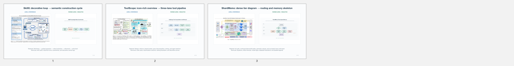

# draw-in-powerpoint

用 Codex 把论文方法描述转化为**结构正确、可逐对象编辑、可继续升级视觉风格的 PowerPoint 插图**。

当前版本聚焦最关键的 Level 1：先确认方法图的语义骨架，再用图标或插画升级表现，而不是一开始就被具体画风锁定。



## 为什么先做 Level 1

一张方法图首先是技术关系图，其次才是视觉作品。过早添加机器人、人物和场景，容易掩盖箭头方向、模块边界或贡献位置的问题。

本项目把绘图拆成三个可递进、可回退的层级：

| 层级 | 视觉构成 | 主要目标 | 当前状态 |
|---|---|---|---|
| **Level 1** | 线条、箭头、图框、文字框、基本几何 | 验证语义、结构、阅读顺序与论文缩放可读性 | **已实现核心工作流** |
| **Level 2** | Level 1 骨架 + 少量图标/轻卡通元素 | 用小型视觉资产替代局部模块，提升辨识度 | 通过 `asset_slot` 预留升级接口 |
| **Level 3** | 插画、角色、场景成为主要叙事元素 | 形成统一画风和强视觉记忆点 | 规划中，仍需继承已确认的语义图 |

层级表示具象视觉的占比与制作复杂度，不代表论文或插图质量。

[查看三个 Level 的完整视觉样本与判定标准](docs/VISUAL_LEVELS.md)

## 绘图流程


核心原则是：**先确认语义图，再确认版式，最后增加视觉资产。** Level 2/3 可以改变模块的表现形式，但未经确认不得改变 Level 1 中的节点、边、分组和技术含义。

[阅读完整制作流程、阶段输入输出与确认门](docs/DRAWING_WORKFLOW.md)

## 当前能力

- 从 Method 文本、伪代码、草图或现有 PPTX 提取 Figure Brief。
- 使用稳定的节点、边、分组和 `asset_slot` 生成 Level 1 语义规格。
- 校验未知节点、重复 ID、不合法环路、标签长度和布局字段。
- 一次生成 2–3 个结构真正不同的候选页，而非只换颜色。
- 支持 pipeline、swimlane、hub-spoke 等常用学术图布局。
- 输出由 PowerPoint 原生形状、文本框和连接线构成的可编辑 PPTX。
- 为 Level 2 图标替换和 Level 3 插画升级保留稳定对象命名与连接关系。

## 快速开始

本 Skill 面向带有 PowerPoint/Artifact Tool 运行环境的 Codex 工作区。

先验证示例语义规格：

```bash
node scripts/validate_level1_spec.mjs \
  --spec assets/level1-example-spec.json
```

再生成候选结构：

```bash
node scripts/create_level1_figure.mjs \
  --spec assets/level1-example-spec.json \
  --out output/agent-skill-level1.pptx \
  --preview-dir output/agent-skill-level1-preview
```

在用户选定布局后，把 `selected_layout` 写回规格并重新生成。交付前检查导出的 layout JSON：

```bash
node scripts/check_layout.mjs \
  --layout-dir output/agent-skill-level1-preview
```

语义格式、布局模式与 QA 规则分别见：

- [Level 1 语义语法](references/level-1-grammar.md)
- [布局模式](references/layout-patterns.md)
- [PowerPoint 制作约束](references/powerpoint-authoring.md)
- [质量检查清单](references/quality-checklist.md)

## 仓库结构

```text
.
├── SKILL.md                         # Codex Skill 主入口
├── agents/openai.yaml               # Skill 展示与默认提示
├── assets/                          # 示例规格、组件库与预览
├── docs/                            # GitHub 使用说明与视觉样本
├── references/                      # 工作流、语法、布局、风格和 QA 规范
└── scripts/                         # 规格校验、PPTX 生成与布局检查
```

本地 `research/` 与 `output/` 用于研究采集和生成过程，不直接提交；适合公开展示的接触表、对比图与来源索引会经过筛选后放入 `docs/`。

## 视觉研究样本

仓库中的三个视觉接触表来自 Agent Skill 方向的 arXiv 论文 Figure 风格研究，共 45 张样本：Level 1 为 12 张、Level 2 为 26 张、Level 3 为 7 张。

这些图仅用于非商业的风格分析、分类说明和工作流研究，著作权归原论文作者或权利人所有，不属于本项目可复用素材库。每张图的论文标题、Figure 编号、arXiv 链接和分类理由见[来源与分类索引](docs/data/agent-skill-visual-classification.csv)。

## 项目边界

- 不把整张论文方法图扁平化成一张不可编辑的 AI 图片。
- 不把参考论文中的独特角色、插画或受保护资产直接当作组件复用。
- 不把“CCF-A 风格”理解为会议制定的统一绘图规范；这里指 AI 顶会论文中常见的克制、结构清晰、适合出版的视觉表达。
- 不用装饰补救尚未确认的技术结构。

更完整的项目定位见 [REPOSITORY_PURPOSE.md](REPOSITORY_PURPOSE.md)。

## 路线图

- [x] Level 1 语义规格、验证器与候选布局生成
- [x] 论文 Figure 三档视觉样本研究
- [x] Level 2 参考图到 Level 1 骨架的解析实验
- [ ] Level 2 组件素材库、检索与 `asset_slot` 自动替换
- [ ] Level 3 统一画风、角色设定与场景组合流程
- [ ] 端到端论文尺寸导出与回归测试
