# draw-in-powerpoint

当前仓库只做一件事：**给定一张论文插图，按原画布、原文案、原布局、原对象关系和原视觉样式，复刻成可编辑 PowerPoint。**

这不是“理解原图后重新画一张意思相近的图”。1 → 1 阶段禁止改写标题、删减元素、重新排版、替换结构或用整张参考图铺底。只有通过自动差异门禁的案例，才会计入合格复刻数。

## 复刻逻辑：从参考图到可编辑 PPTX

严格复刻的核心不是先提取论文的语义再设计新图，而是把参考图视为唯一真值，按对象、坐标和视觉属性逐层还原。

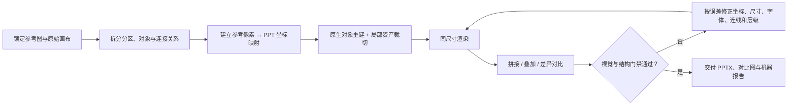

### 1. 锁定真值，不允许语义替代

- 以指定 PDF 页面或 PNG 为唯一参考，记录原始宽高比、裁切范围和渲染尺寸。
- 识别所有可见文字、分区、模块、重复图元、箭头、图例、轴线和装饰线；即使元素不影响论文语义，也不得省略。
- 每个案例在 `benchmark/strict/*.json` 中声明参考图、裁切区域、必须文字、最低对象数和硬性阈值。

### 2. 先恢复几何骨架，再处理细节

参考图像素坐标按固定比例映射到 PowerPoint 画布。调整顺序始终是：

1. 画布比例与外边界；
2. 大分区、主轴和关键锚点；
3. 模块的中心、宽高、间距与对齐线；
4. 箭头、回路、跳连和层级关系；
5. 文字内容、换行、字号、颜色与字重；
6. 线宽、虚线节奏、圆角、透明度和局部图像裁切。

这个顺序可以避免在整体版式尚未对齐时，过早消耗时间调整字体或局部装饰。

### 3. 原生重建为主，局部资产为辅

| 参考图元素 | 复刻方式 | 原因 |
|---|---|---|
| 标题、标签、注释、数值 | PowerPoint 文本对象 | 保持可编辑，并可做文本完整性审计 |
| 面板、卡片、节点、柱体、背景色块 | PowerPoint 形状 | 保留尺寸、颜色、边框和层级的精确控制 |
| 箭头、跳连、回路、括号、虚线分区 | PowerPoint 线条或自由形状 | 保留连接方向和可调整的几何关系 |
| 真实照片、纹理、无法稳定排版的复杂公式/标识 | 从参考图精确裁切的局部图像 | 保持原始像素细节，且不破坏其他对象的可编辑性 |
| 整张参考图 | **禁止使用** | 防止以整图铺底伪装成高保真复刻 |

生成脚本为每个对象显式写入坐标、尺寸、文字和样式。需要局部图像时，由 `scripts/crop_image_asset.py` 从已锁定的参考图裁切，不另行生成或替换内容。

### 4. 同尺寸渲染，用误差驱动迭代

参考图与 PPTX 必须渲染到同一像素尺寸，然后同时查看三种证据：

- **左右拼接图**：判断文字、模块、视觉节奏与整体密度是否一致；
- **50% 透明叠加图**：定位坐标偏移、尺寸偏差和边缘错位；
- **放大差异图**：定位颜色、线宽、抗锯齿和未覆盖区域。

每轮修正都回到生成脚本，而不是手工修改最终 PPTX，以保证结果可重建。调整会继续迭代，直到视觉差异与结构审计同时达标。

### 5. 同时验收“像”与“真的重建了”

视觉层面计算全图像素相似度、前景 IoU 和边缘 IoU；结构层面直接解析 PPTX 的 OOXML，检查关键文字、对象数、图片数和图片覆盖面积。任意一项未达到案例声明的阈值，都不计入 1 → 1 复刻成绩。

最终每个案例交付一组可追溯产物：可编辑 PPTX、参考渲染图、复刻渲染图、左右拼接图、50% 叠加图、差异图和 `report.json`。

## 当前严格结果

| 案例 | 像素相似度 | 前景 IoU | 边缘 IoU | 文本覆盖率 | PPT 对象数 | 整页图片铺底 | 结果 |
|---|---:|---:|---:|---:|---:|---:|---|
| Skill-MoE Figure 1 | 98.72% | 83.94% | 73.11% | 100% | 193 | 0 | **PASS** |
| ACL 2024 · OBSD Figure 2 | 94.69% | 93.42% | 56.59% | 100% | 34 | 0 | **PASS** |
| EMNLP 2024 · PROF Figure 1 | 94.12% | 89.51% | 39.58% | 100% | 37 | 0 | **PASS** |
| ICLR 2024 · MMICL Figure 2 | 96.66% | 83.27% | 46.29% | 100% | 92 | 0 | **PASS** |
| ACL 2024 · TransliCo Figure 2 | 96.30% | 86.28% | 50.41% | 100% | 87 | 0 | **PASS** |
| ICML 2024 · Early Exiting Figure 2 | 95.36% | 83.42% | 59.06% | 100% | 73 | 0 | **PASS** |
| ICLR 2024 · Unified Sampling Framework Figure 4 | 97.09% | 59.23% | 39.75% | 100% | 51 | 0 | **PASS** |
| ICML 2024 · FiT Figure 2 | 97.82% | 87.60% | 65.95% | 100% | 43 | 0 | **PASS** |
| NeurIPS 2024 · ControlMLLM Figure 1 | 94.93% | 86.57% | 56.94% | 100% | 61 | 0 | **PASS** |
| NeurIPS 2024 · Diffusion of Thought Figure 2 | 94.61% | 55.10% | 29.55% | 100% | 113 | 0 | **PASS** |
| CVPR 2024 · SNED Figure 1 | 89.61% | 45.22% | 36.76% | 100% | 417 | 0 | **PASS** |


[查看透明叠加图](docs/strict-recreation/skillmoe-fig1/skillmoe-fig1-overlay.png) · [查看差异热图](docs/strict-recreation/skillmoe-fig1/skillmoe-fig1-diff.png) · [查看完整机器报告](docs/strict-recreation/skillmoe-fig1/report.json) · [下载可编辑 PPTX](SkillMoE_Fig2_corrected_editable.pptx)

### Skill-MoE Figure 1 · 校准样例

1. 以 `SkillMoE_Fig1.pdf` 的 540 × 540 pt 页面为唯一真值，不重写任何可见文字。
2. 保留三段虚线分区、四条 rollout、五个 expert、三组 skill library、右侧五项演化操作和底部十柱结果图。
3. 机器人、圆形状态、箭头、卡片、括号、图例、坐标轴和柱体分别保留为独立对象；当前 PPTX 第一页包含 193 个对象。
4. 用与参考图相同的正方形画布渲染到 1350 × 1350 px，再计算全图像素差、前景交并比和边缘交并比。
5. 从 PPTX 的 OOXML 中提取文字与对象，要求 37 个关键文本全部出现，同时拒绝覆盖画布 80% 以上的单张图片。

### ACL 2024 · OBSD Figure 2

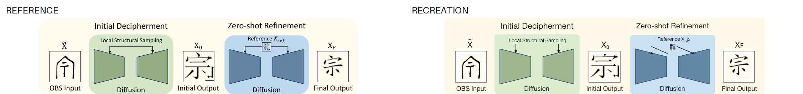

复刻逻辑：保持左右两阶段的原始尺寸和颜色；输入、初始输出、参考字形与最终输出作为局部研究资产，其余标题、面板、扩散梯形、箭头和标签均为独立 PowerPoint 对象。

[叠加图](docs/strict-recreation/acl-obsd-fig2/acl-obsd-fig2-overlay.png) · [差异图](docs/strict-recreation/acl-obsd-fig2/acl-obsd-fig2-diff.png) · [报告](docs/strict-recreation/acl-obsd-fig2/report.json) · [PPTX](docs/strict-recreation/acl-obsd-fig2/editable.pptx)

### EMNLP 2024 · PROF Figure 1

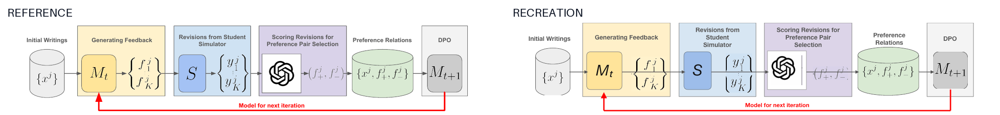

复刻逻辑：逐一保留七个模块、五条前向箭头和红色反馈回路；论文公式与模型标识作为局部图像资产，模块背景、标题、模型框、箭头和反馈标签保持独立可编辑。

[叠加图](docs/strict-recreation/emnlp-prof-fig1/emnlp-prof-fig1-overlay.png) · [差异图](docs/strict-recreation/emnlp-prof-fig1/emnlp-prof-fig1-diff.png) · [报告](docs/strict-recreation/emnlp-prof-fig1/report.json) · [PPTX](docs/strict-recreation/emnlp-prof-fig1/editable.pptx)

### ICLR 2024 · MMICL Figure 2

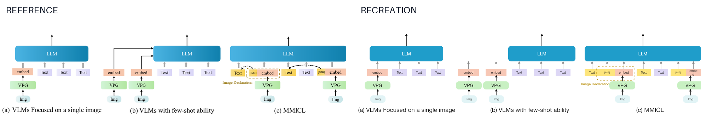

复刻逻辑：保留三个并排子图、三组 LLM 主模块、VPG/Img 层级、逐 token 上行箭头以及 MMICL 的 Image Declaration 虚线分组；所有 92 个对象均独立保留。

[叠加图](docs/strict-recreation/iclr-mmicl-fig2/iclr-mmicl-fig2-overlay.png) · [差异图](docs/strict-recreation/iclr-mmicl-fig2/iclr-mmicl-fig2-diff.png) · [报告](docs/strict-recreation/iclr-mmicl-fig2/report.json) · [PPTX](docs/strict-recreation/iclr-mmicl-fig2/editable.pptx)

### ACL 2024 · TransliCo Figure 2

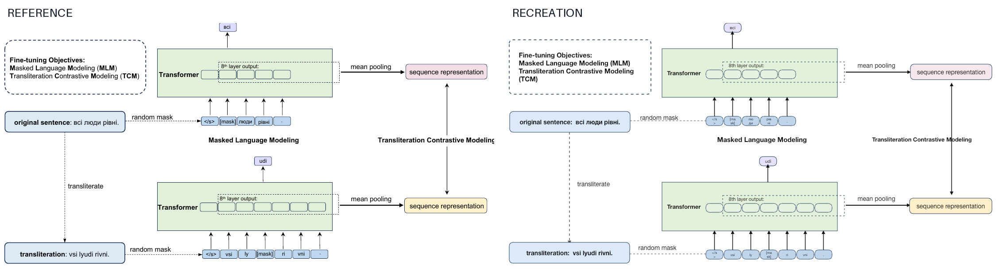

复刻逻辑：上下两条 Transformer 分支保持原坐标；原文、转写、random mask、逐 token 箭头、mean pooling、序列表征和双向对比关系完整复刻。

[叠加图](docs/strict-recreation/acl-translico-fig2/acl-translico-fig2-overlay.png) · [差异图](docs/strict-recreation/acl-translico-fig2/acl-translico-fig2-diff.png) · [报告](docs/strict-recreation/acl-translico-fig2/report.json) · [PPTX](docs/strict-recreation/acl-translico-fig2/editable.pptx)

### ICML 2024 · Early Exiting Figure 2

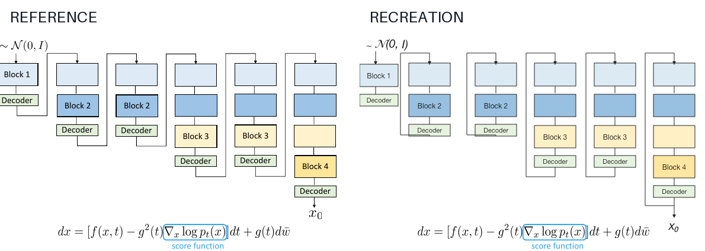

复刻逻辑：逐塔保留逐渐加深的 block、Decoder 退出点、外侧 skip path、噪声输入与最终输出；论文公式作为局部研究资产嵌入，不使用整图铺底。

[叠加图](docs/strict-recreation/icml-early-exit-fig2/icml-early-exit-fig2-overlay.png) · [差异图](docs/strict-recreation/icml-early-exit-fig2/icml-early-exit-fig2-diff.png) · [报告](docs/strict-recreation/icml-early-exit-fig2/report.json) · [PPTX](docs/strict-recreation/icml-early-exit-fig2/editable.pptx)

### ICLR 2024 · Unified Sampling Framework Figure 4

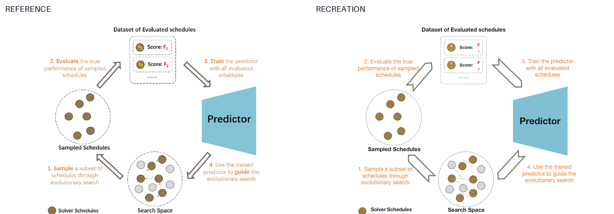

复刻逻辑：按原始环形顺序复刻 Search Space、Sampled Schedules、评估集和 Predictor，并保留每个 schedule 节点、评分行、四条空心粗箭头与四段橙色步骤说明。

[叠加图](docs/strict-recreation/iclr-usf-fig4/iclr-usf-fig4-overlay.png) · [差异图](docs/strict-recreation/iclr-usf-fig4/iclr-usf-fig4-diff.png) · [报告](docs/strict-recreation/iclr-usf-fig4/report.json) · [PPTX](docs/strict-recreation/iclr-usf-fig4/editable.pptx)

### ICML 2024 · FiT Figure 2

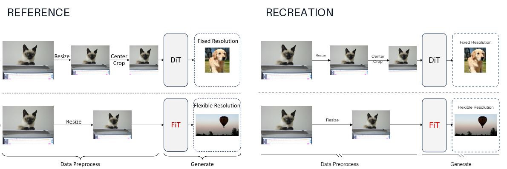

复刻逻辑：七个输入/处理中间态/输出图像作为独立局部资产；Resize、Center Crop、DiT/FiT、分辨率虚线框、箭头和两段底部括号均保持可编辑。

[叠加图](docs/strict-recreation/icml-fit-fig2/icml-fit-fig2-overlay.png) · [差异图](docs/strict-recreation/icml-fit-fig2/icml-fit-fig2-diff.png) · [报告](docs/strict-recreation/icml-fit-fig2/report.json) · [PPTX](docs/strict-recreation/icml-fit-fig2/editable.pptx)

### NeurIPS 2024 · ControlMLLM Figure 1

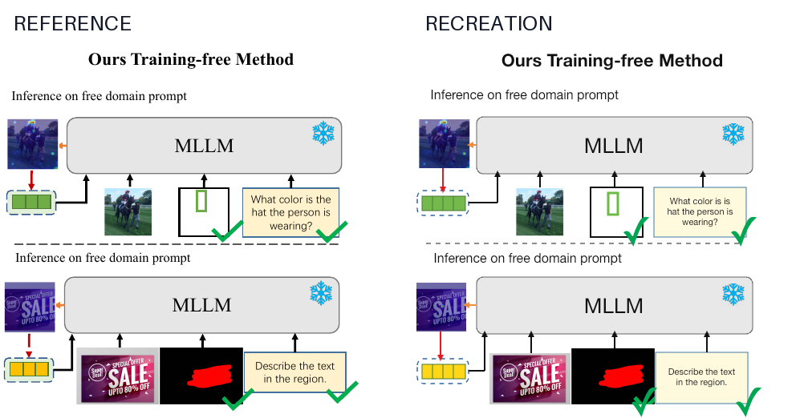

复刻逻辑：上下两个 inference 场景复用同尺寸 MLLM，保留 source prompt、四格视觉 prompt、局部图像/区域、问题框、冻结标记、方向箭头与验证勾；只把论文中的真实图片作为局部资产。

[叠加图](docs/strict-recreation/neurips-controlmllm-fig1/neurips-controlmllm-fig1-overlay.png) · [差异图](docs/strict-recreation/neurips-controlmllm-fig1/neurips-controlmllm-fig1-diff.png) · [报告](docs/strict-recreation/neurips-controlmllm-fig1/report.json) · [PPTX](docs/strict-recreation/neurips-controlmllm-fig1/editable.pptx)

### NeurIPS 2024 · Diffusion of Thought Figure 2

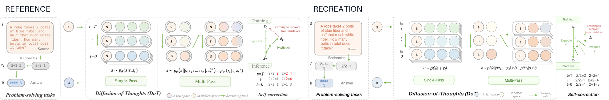

复刻逻辑：完整保留 problem-solving、Single-Pass、Multi-Pass 和 self-correction 四个区域；113 个对象覆盖源文本、rationale、token 状态、虚实空间、推理路径、训练轨迹和推理公式，不使用任何图片资产。

[叠加图](docs/strict-recreation/neurips-dot-fig2/neurips-dot-fig2-overlay.png) · [差异图](docs/strict-recreation/neurips-dot-fig2/neurips-dot-fig2-diff.png) · [报告](docs/strict-recreation/neurips-dot-fig2/report.json) · [PPTX](docs/strict-recreation/neurips-dot-fig2/editable.pptx)

### CVPR 2024 · SNED Figure 1

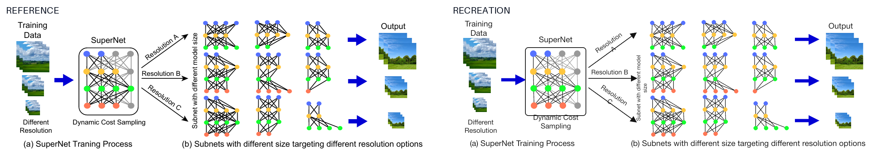

复刻逻辑：训练与输出图像栈作为六个局部资产；SuperNet、九个子网、全部分层节点和稠密连边、三条分辨率路径与三条输出箭头由 417 个 PowerPoint 对象重建。该图的较低像素相似度主要来自稠密边的逐像素位置差异，完整指标和阈值保留在机器报告中。

[叠加图](docs/strict-recreation/cvpr-sned-fig1/cvpr-sned-fig1-overlay.png) · [差异图](docs/strict-recreation/cvpr-sned-fig1/cvpr-sned-fig1-diff.png) · [报告](docs/strict-recreation/cvpr-sned-fig1/report.json) · [PPTX](docs/strict-recreation/cvpr-sned-fig1/editable.pptx)

## 严格 1 → 1 门禁

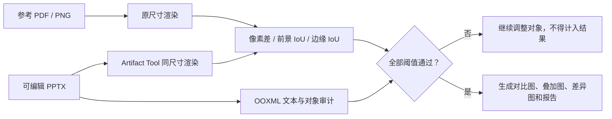

每个案例必须同时满足：

- 原画布比例与完整可见内容一致；
- 关键文字 100% 覆盖，不允许同义改写；
- 模块、重复图元、连线、颜色角色和相对坐标不省略；
- 不存在整页或近整页参考图铺底；
- 对象数量达到案例声明的最低覆盖要求；
- 像素相似度、前景 IoU 和边缘 IoU 达到案例自己的硬阈值；
- 机器报告、参考/复刻拼接图、50% 透明叠加图和差异热图全部生成。

运行严格门禁：

```bash
npm run qa:strict
```

使用 `npm run build:strict` 可从生成脚本重新构建当前全部顶会 PPTX，再运行统一门禁。

严格案例清单位于 [`benchmark/strict/manifest.json`](benchmark/strict/manifest.json)，每个案例的真值、PPTX、关键文本和阈值在 `benchmark/strict/*.json` 中声明。

## 三阶段路线

| 阶段 | 输入 | 输出 | 状态 |
|---|---|---|---|
| **1 → 1：严格复刻** | 一张论文参考图 | 内容与版式一致的可编辑 PPTX | **10/10 顶会案例通过，另有 1 个校准样例** |
| **0.5 → 1：受控改写** | 参考图 + Method + 改写要求 | 表述相近、风格或排版不同的新图 | 未开始 |
| **0 → 1：原创生成** | Method + 用户要求 | 一张或多张论文插图 | 未开始 |

只有严格复刻累计至少 10 张已发表顶会论文插图并全部通过门禁后，仓库才进入 0.5 → 1。Skill-MoE 校准样例不占这 10 张名额。

## 关于旧 benchmark

`benchmark/cases/` 和 `docs/benchmark/` 中原有的 10 个案例只复现了论文图的语义骨架，存在删减、改写和重新排版。它们已被明确降级为 **semantic sketch / 结构草图**：

- 不计入 1 → 1 合格数；
- 不再作为首页复刻效果；
- 仅保留用于未来研究“场景规格为什么会丢失细节”；
- 在通过同一套严格门禁前，不得重新标记为复刻。

## 仓库结构

```text
.
├── benchmark/
│   ├── strict/                       # 严格 1→1 真值、阈值与清单
│   └── cases/                        # 已降级的语义草图规格
├── docs/
│   ├── strict-recreation/            # PASS 案例的对比、叠加、差异和报告
│   └── benchmark/                    # 旧语义草图输出，不计入成绩
├── scripts/
│   ├── strict_recreation_qa.py       # 像素、文字、对象与反铺底门禁
│   ├── validate_reference_scene.mjs  # 旧 Scene Spec 校验
│   └── create_reference_recreation.mjs
├── SkillMoE_Fig1.pdf                 # 首个严格参考
└── SkillMoE_Fig2_corrected_editable.pptx
```

## 来源与使用边界

参考论文插图只用于非商业研究、评估和复刻工作流验证；著作权归论文作者或其他权利人所有。发布或再利用前，请核对论文页面、会议政策和原始许可。

## 路线图

- [x] 撤销“语义相似即可视为复刻”的旧验收口径
- [x] 建立像素差、前景 IoU、边缘 IoU、关键文本和对象覆盖率门禁
- [x] 禁止整页参考图铺底
- [x] 完成严格 1 → 1 校准样例：Skill-MoE Figure 1
- [x] 完成 10 张已发表顶会论文插图的严格复刻
- [x] 10/10 顶会案例全部通过统一门禁
- [ ] 在用户确认 1 → 1 阶段质量后，再开始 0.5 → 1
