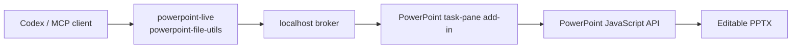

# PowerPoint Canvas Controller for macOS

[中文说明](README.zh-CN.md)

A macOS-first continuation of
[wangzian828/powerpoint-canvas-controller](https://github.com/wangzian828/powerpoint-canvas-controller).
It preserves the upstream MCP tool contract while replacing the Windows-only COM runtime with a
PowerPoint task-pane bridge built on Microsoft's PowerPoint JavaScript API.

The result is a local Codex plugin that can create, inspect, revise, save, and export native editable
PowerPoint objects without runtime mouse or keyboard automation.

## Current scope

- Native editable shapes, text boxes, lines, pictures, groups, and named objects.
- Paced batch drawing through `powerpoint_live_draw_sequence`.
- Slide inspection, 16:9 bounds validation, PNG previews, PPTX saving, and PDF export.
- A localhost-only bridge: HTTPS `127.0.0.1:43127` for the task pane and HTTP
  `127.0.0.1:43128` for the MCP backend.
- The original Windows PowerShell/COM backend remains available on Windows.

On macOS, connectors are managed native line objects. Moves performed through the MCP update tools
reroute them; arbitrary manual dragging in PowerPoint does not automatically reroute them.
This first milestone targets 16:9 decks (`960 × 540` PowerPoint points). The current PowerPoint
JavaScript API does not expose reliable text-overflow metrics, so macOS validation checks object
bounds and still requires screenshot review for text fit.

## Architecture



AppleScript is used only to activate PowerPoint and open, save, or close a presentation. Slide
creation and editing run through the PowerPoint JavaScript API.

## Requirements

- macOS 13 or later.
- Node.js 20 or later.
- An installed **and activated** desktop Microsoft PowerPoint. If PowerPoint displays
  “Subscription required to edit and save,” Office disables editing and add-ins, so live integration
  cannot run until PowerPoint is activated.

## Install on macOS

```bash
git clone https://github.com/goya4140/powerpoint-canvas-controller-macos.git
cd powerpoint-canvas-controller-macos
npm install
npm run setup:macos
```

`setup:macos` installs a trusted localhost development certificate, copies the add-in manifest to
PowerPoint's macOS sideload directory, and starts the local broker.

Then:

1. Restart PowerPoint.
2. Open an editable presentation.
3. Choose **Home → Add-ins → PowerPoint Canvas Bridge**.
4. Keep that task pane open while using the MCP tools. Keep the bridge closed in other
   presentations so commands cannot target the wrong document.

The repository's [`.mcp.json`](.mcp.json) exposes two servers:

- `powerpoint-live` for live drawing and revision.
- `powerpoint-file-utils` for inspection, validation, saving, and export.

## Development and verification

```bash
npm run check
npm run validate:addin
npm run test:protocol
npm run self-test
```

The first three commands do not require an activated PowerPoint session. `npm run self-test` is the
real host integration test and requires the task pane to be connected in an activated PowerPoint.

The protocol test starts the broker on isolated ports, simulates a PowerPoint task pane, and verifies
the full command lifecycle: registration, polling, result delivery, error behavior, and static asset
serving.

## Repository layout

```text
.codex-plugin/plugin.json             Codex plugin manifest
.mcp.json                             MCP server definitions
office-addin/                         PowerPoint task pane and Office manifest
scripts/live-server.mjs               Live-edit MCP server
scripts/file-server.mjs               File/validation MCP server
scripts/macos-broker-server.mjs       Local HTTPS/HTTP broker
scripts/macos-bridge.mjs              macOS host and broker adapter
scripts/powerpoint-bridge.ps1         Preserved Windows COM backend
skills/control-powerpoint-canvas-macos/
tests/macos-broker.test.mjs           Broker protocol integration test
```

## Attribution

This repository retains the upstream Git history and MIT license. The MCP surface and the original
Windows implementation come from
[wangzian828/powerpoint-canvas-controller](https://github.com/wangzian828/powerpoint-canvas-controller);
the macOS Office Add-in backend and associated setup/tests are added here.

## Security

The broker binds only to loopback. It does not expose a network-facing service, but any process on
the same Mac can reach the local control port while the broker is running. Do not run untrusted local
software alongside a sensitive open presentation.
