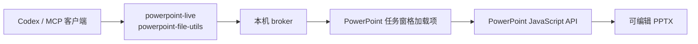

# PowerPoint Canvas Controller for macOS

[English](README.md)

这是基于
[wangzian828/powerpoint-canvas-controller](https://github.com/wangzian828/powerpoint-canvas-controller)
继续开发的 macOS 优先版本。它保留上游 MCP 工具契约，把原本仅支持 Windows 的 COM 运行时替换为
基于 Microsoft PowerPoint JavaScript API 的任务窗格桥接。

它可以让 Codex 在不使用系统鼠标、键盘自动化的情况下，创建、检查、修改、保存和导出原生可编辑的
PowerPoint 对象。

## 当前能力

- 原生可编辑形状、文本框、直线、图片、组合和命名对象。
- 使用 `powerpoint_live_draw_sequence` 分步绘制。
- 幻灯片检查、16:9 越界验证、PNG 预览、PPTX 保存和 PDF 导出。
- 仅监听本机回环地址：任务窗格使用 HTTPS `127.0.0.1:43127`，MCP 后端使用 HTTP
  `127.0.0.1:43128`。
- Windows 上仍保留原项目的 PowerShell/COM 后端。

macOS 的连接线是受控的原生直线对象：通过 MCP 更新形状时会重新路由；如果直接在 PowerPoint
界面里任意拖动形状，则不会自动重新路由。
第一个里程碑以 16:9 演示文稿（`960 × 540` PowerPoint 点）为目标。当前 PowerPoint
JavaScript API 没有暴露可靠的文本溢出指标，因此 macOS 验证会检查对象边界，文字适配仍需结合
截图复核。

## 架构



AppleScript 只负责激活 PowerPoint，以及打开、保存或关闭演示文稿；幻灯片对象的创建和编辑都由
PowerPoint JavaScript API 完成。

## 环境要求

- macOS 13 或更高版本。
- Node.js 20 或更高版本。
- 已安装并激活的桌面版 Microsoft PowerPoint。如果 PowerPoint 显示“需要订阅才可编辑和保存”，
  Office 会禁用编辑和加载项，激活前无法进行真实集成测试。

## macOS 安装

```bash
git clone https://github.com/goya4140/powerpoint-canvas-controller-macos.git
cd powerpoint-canvas-controller-macos
npm install
npm run setup:macos
```

`setup:macos` 会安装可信的 localhost 开发证书，把加载项清单复制到 PowerPoint 的 macOS
旁加载目录，并启动本机 broker。

然后：

1. 重启 PowerPoint。
2. 打开一个可编辑演示文稿。
3. 选择 **开始 → 加载项 → PowerPoint Canvas Bridge**。
4. 使用 MCP 工具期间保持该任务窗格打开，并关闭其他演示文稿中的同名任务窗格，避免命令指向
   错误文档。

仓库中的 [`.mcp.json`](.mcp.json) 暴露两个服务：

- `powerpoint-live`：实时绘制和修改。
- `powerpoint-file-utils`：检查、验证、保存和导出。

## 开发与验证

```bash
npm run check
npm run validate:addin
npm run test:protocol
npm run self-test
```

前三项不要求 PowerPoint 已激活。`npm run self-test` 是真实宿主集成测试，需要激活 PowerPoint
并打开任务窗格。

协议测试会在隔离端口启动 broker，模拟 PowerPoint 任务窗格，并验证完整命令生命周期：注册、
轮询、结果回传、错误行为和静态资源服务。

## 仓库结构

```text
.codex-plugin/plugin.json             Codex 插件清单
.mcp.json                             MCP 服务定义
office-addin/                         PowerPoint 任务窗格和 Office 清单
scripts/live-server.mjs               实时编辑 MCP 服务
scripts/file-server.mjs               文件/验证 MCP 服务
scripts/macos-broker-server.mjs       本机 HTTPS/HTTP broker
scripts/macos-bridge.mjs              macOS 主机与 broker 适配层
scripts/powerpoint-bridge.ps1         保留的 Windows COM 后端
skills/control-powerpoint-canvas-macos/
tests/macos-broker.test.mjs           broker 协议集成测试
```

## 来源与许可

本仓库保留上游 Git 历史和 MIT 许可证。MCP 工具表面及 Windows 实现来自
[wangzian828/powerpoint-canvas-controller](https://github.com/wangzian828/powerpoint-canvas-controller)；
本仓库新增 macOS Office 加载项后端、安装流程和测试。

## 安全说明

broker 只绑定回环地址，不会暴露为网络服务；但 broker 运行期间，同一台 Mac 上的其他进程仍可
访问本机控制端口。打开敏感演示文稿时，不要同时运行不可信的本地软件。
