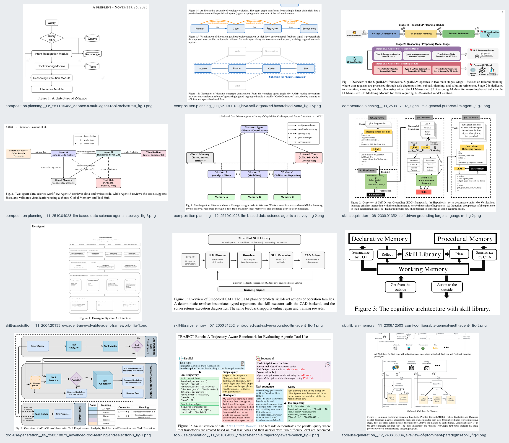
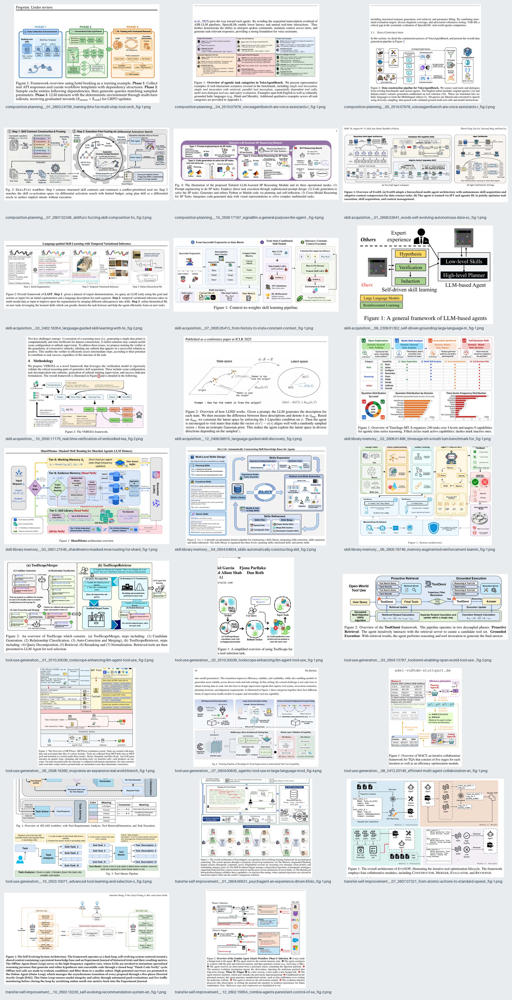
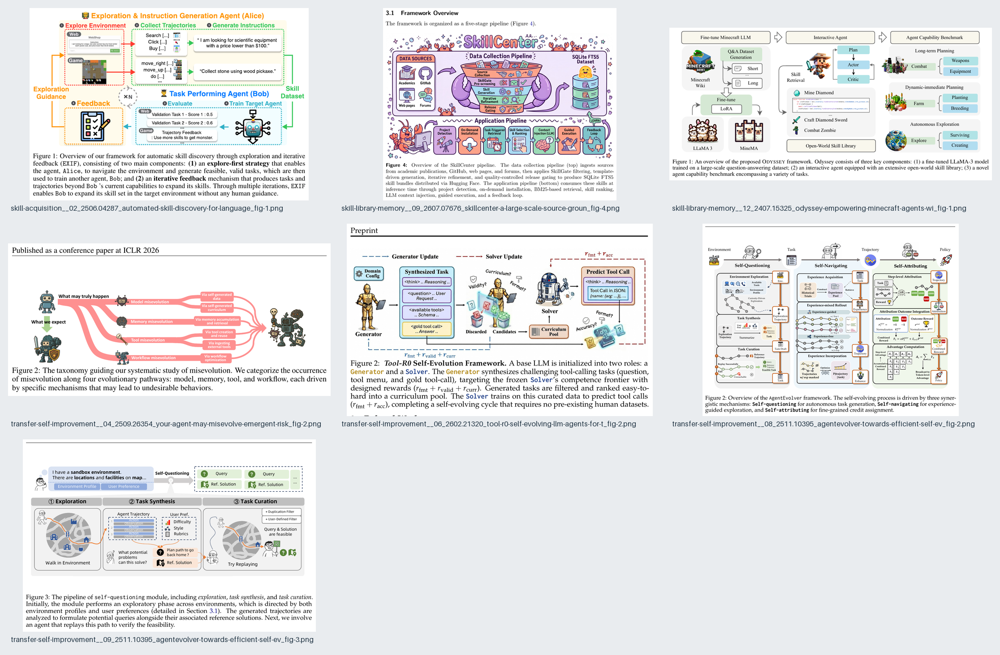

# 视觉效果分级与研究样本

## 分类目的

我们用三个 Level 描述论文 Figure 中具象图标、卡通角色和场景插画的占比，以及它们承担技术叙事的程度。分类不评价论文质量，也不表示某个 Level 天然更适合发表。

样本集聚焦 Agent Skill 相关 arXiv 论文，共 45 张方法总览、系统架构或工作流 Figure。逐图的论文标题、Figure 编号、arXiv 页面、分类理由和文件校验值见[来源与分类索引](data/agent-skill-visual-classification.csv)。

## Level 1：纯线条与基本图形

**样本数：12**

画面主要由箭头、图框、文字框、连接线和简单几何形状构成。具象图标即使出现，也不是主要叙事载体。

适用特点：

- 技术关系最直接，适合确认流程、层级和系统边界；
- PowerPoint 原生对象容易生成、编辑和复用；
- 论文缩放与灰度打印稳定；
- 是 Level 2/3 的语义源图。

典型参考：Embodied CAD 的横向工具链、Z-Space 的模块流程和多 Agent 架构图。

## Level 2：图标或轻量卡通点缀

**样本数：26**

流程骨架仍由框、线和分组构成，但机器人、人物、网络、数据库、工具或小场景承担局部语义。Level 2 是本项目的主要目标形态之一。

适用特点：

- 比纯框图更容易快速识别模块角色；
- 可以把视觉资产限制在局部 `asset_slot` 中；
- 仍能保持清晰的论文方法图结构；
- 适合建立可检索、可替换的小模块素材库。

典型参考：SkillX、ToolScope、ShardMemo 等图中的机器人、数据库、人物、工具与场景小图。

## Level 3：卡通与具象视觉主导

**样本数：7**

角色、场景、游戏画面或强视觉插画成为主要画面，框线与箭头退居辅助位置。Level 3 也是目标形态，但制作前必须已经确认 Level 1。

适用特点：

- 视觉记忆点强，适合强调系统故事与角色关系；
- 需要统一的角色、色板、线条和场景规则；
- 单个资产尺寸更容易迫使构图变化；
- 必须保留 Level 1 对照层以防技术关系漂移。

典型参考：SkillCenter 的完整插画系统、Tool-R0 的角色化生成器/求解器和 AgentEvolver 的场景叙事。

## 从 Level 2 反向解析 Level 1

下面的实验选择了 SkillX、ToolScope 和 ShardMemo 三张信息密度较高的 Level 2 图，保留它们的核心节点、分组、箭头和反馈关系，同时去掉图标、装饰、局部说明和过细的实现细节。

该实验验证了后续工作流的基本假设：

- Level 2/3 图可以反向还原为更稳定的 Level 1 语义图；
- 视觉升级应替换局部模块，而不是重建整张关系图；
- 高密度参考图需要先区分“技术必需信息”和“视觉/说明性信息”；
- 一张好的 Level 1 图在移除所有图标后仍应可以独立理解。

## 样本来源与使用边界

接触表中的图片来自公开可访问的 arXiv 论文 PDF，由项目按 Figure caption 定位并裁剪，用于非商业的风格分析、分类说明和工作流研究。

- 著作权归原论文作者或其他权利人所有。
- 接触表不是可复用插画素材库，不应直接复制其中的独特角色、图标或完整构图。
- 公开引用或使用单篇论文 Figure 时，应访问索引中的 arXiv 页面，核对论文版本、许可与引用要求。
- 本项目的 Level 定义是内部设计方法，不是 arXiv、CCF 或任何会议的官方分类。

具有代表性的来源包括：

- [Embodied CAD](https://arxiv.org/abs/2606.31252)
- [SkillX](https://arxiv.org/abs/2604.04804)
- [ToolScope](https://arxiv.org/abs/2510.20036)
- [ShardMemo](https://arxiv.org/abs/2601.21545)
- [SkillCenter](https://arxiv.org/abs/2607.07676)
- [Tool-R0](https://arxiv.org/abs/2602.21320)
- [AgentEvolver](https://arxiv.org/abs/2511.10395)
